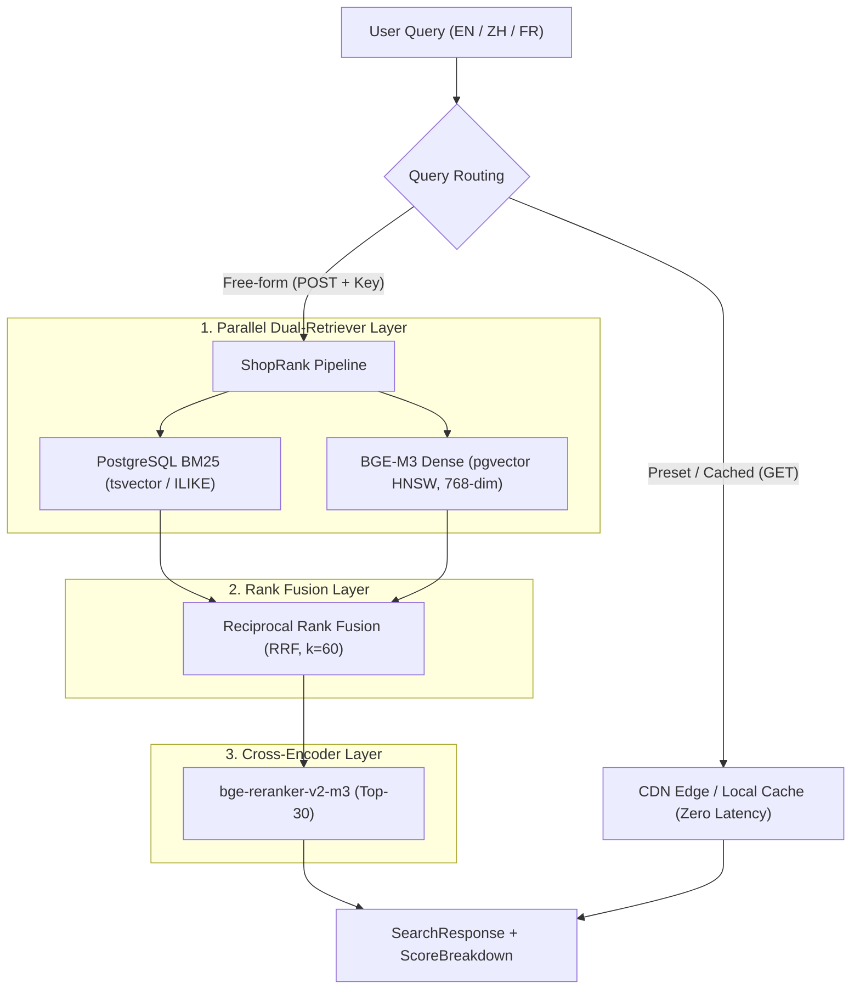

# ShopRank

[](https://github.com/ycheng22/ShopRank/actions/workflows/ci.yml)
[](https://github.com/ycheng22/ShopRank/actions/workflows/deploy.yml)

Production-grade multi-lingual e-commerce search pipeline evaluated on Amazon ESCI with layer-by-layer ablation and explainable rank score breakdowns.

**Live Demo:** [https://shoprank.vectorlab.me](https://shoprank.vectorlab.me)

## Architecture



## Repositories

- [ShopRank (P1 Application)](https://github.com/ycheng22/ShopRank)
- [RetrievalCore (Shared Core Library)](https://github.com/ycheng22/RetrievalCore)
- [TripAgent (P2 Application)](https://github.com/ycheng22/TripAgent)
- [GateMark (P3 Evaluation Framework)](https://github.com/ycheng22/GateMark)

## Local Development

### One-Click Start (PowerShell)
Launch both the FastAPI backend and the Angular 21 frontend simultaneously:

```powershell
# Launches Backend on http://localhost:8000 and Frontend on http://localhost:4200 in dedicated windows
.\start_local.ps1

# Optional parameters:
.\start_local.ps1 -ApiPort 8080 -UiPort 4200
.\start_local.ps1 -NoNewWindow  # Run both in the current shell as background jobs
```

### Manual Start

#### 1. Backend API (FastAPI)
```powershell
# Ensure dependencies are installed
uv sync

# Launch API with hot-reload
uv run uvicorn app.main:app --host 0.0.0.0 --port 8000 --reload
```
- **API Base**: `http://localhost:8000`
- **Interactive Swagger Docs**: `http://localhost:8000/docs`
- **Health Check**: `http://localhost:8000/healthz` (0 DB calls)

#### 2. Frontend UI (Angular 21)
```powershell
cd web

# Install dependencies and start dev server
npm install
npm start
```
- **Frontend App**: `http://localhost:4200`
- Configured to route API calls to `http://localhost:8000` by default (customizable via `API_BASE_URL` environment variable).

## 1. Ablation Results (English Dev Split)

All figures below are evaluated on the frozen Amazon ESCI dataset (`small_version=1`, `product_locale='us'`, 300 dev queries over a 29,844 product corpus).

<!-- ABLATION_START -->
| Configuration | NDCG@10 | Recall@50 | MRR@10 | p95 Latency (ms) |
| --- | --- | --- | --- | --- |
| BM25 Baseline | 0.4174 | 0.5097 | 0.6616 | 172.4 |
| +dense | 0.4937 | 0.6350 | 0.7234 | 275.2 |
| +hybrid | 0.5132 | 0.6323 | 0.7463 | 364.0 |
| +rerank | 0.5810 | 0.5706 | 0.7939 | 59302.2 |
| +weighted | 0.5777 | 0.5617 | 0.7896 | 58651.1 |
<!-- ABLATION_END -->

### Key Observations
1. **Dense Retrieval Contribution**: Adding BGE-M3 (768-dim Matryoshka) yields a massive **+12.5% boost in Recall@50** (from 50.97% to 63.50%), successfully retrieving semantic matches that exact keyword search misses.
2. **Hybrid Superiority**: RRF rank fusion cleanly merges keyword and dense semantic signals, lifting NDCG@10 to **0.5132** while maintaining a sub-400ms latency.
3. **Cross-Encoder Lift & Latency Trade-off**: Cross-encoder reranking (`BAAI/bge-reranker-v2-m3`) achieves the peak **0.5810 NDCG@10** (+16.4% over BM25) and **0.7939 MRR@10**. However, CPU inference latency on Top-30 candidates is ~59.3s (p95), validating our architectural decision to restrict synchronous heavy cross-encoders to pre-computed cached paths on Cloud Run CPU instances.

## 2. Cross-Lingual Evaluation (3 Locales × 4 Configurations)

Evaluated by querying translated dev sets (`zh` and `fr`) against the unchanged English product catalog:

<!-- CROSSTAB_START -->
| Locale | bm25 | dense | hybrid | hybrid+rerank |
| --- | --- | --- | --- | --- |
| en | 0.4174 | 0.4937 | 0.5132 | 0.5810 |
| zh | 0.0155 | 0.3013 | 0.2998 | 0.3821 |
| fr | 0.0975 | 0.3585 | 0.2710 | 0.3982 |
<!-- CROSSTAB_END -->

- **Lexical Failure on Non-English**: Pure BM25 collapses on Chinese (`0.0155`) due to vocabulary mismatch against English descriptions.
- **Cross-Lingual Dense Bridge**: Dense retrieval natively bridges cross-lingual embeddings to achieve `0.3013`, which further improves to `0.3821` with Cross-Encoder reranking.

## 3. Dimension Ablation (Matryoshka Truncation)

BGE-M3 was trained with Matryoshka Representation Learning, allowing vectors to be cleanly truncated to smaller dimensions while retaining semantic integrity.

| Dimension | NDCG@10 | Recall@50 | Table Size | Index Build Time |
| --- | --- | --- | --- | --- |
| 1024 (Native) | 0.5172 | 0.6341 | 486 MB | 43s |
| 768 (Chosen) | **0.5179** | **0.6365** | 418 MB | 34s |
| 512 | 0.5119 | 0.6299 | 312 MB | 15s |

- Truncating to **768 dimensions** drops the memory footprint by 68 MB (keeping us safely below Neon's 500 MB free quota constraint), while paradoxically *improving* NDCG (0.5179 vs 0.5172). This demonstrates how Matryoshka models place the most discriminative semantic signal in the earliest dimensions, and that discarding lower-variance tails can act as regularization.

## 4. RRF Parameter Sensitivity & Diagnostics

| RRF Parameter | NDCG@10 | Recall@50 | MRR@10 | p95 Latency (ms) |
| --- | --- | --- | --- | --- |
| `k = 10` (high top-rank bias) | 0.5108 | 0.6300 | 0.7431 | 340.2 |
| `k = 60` (default) | **0.5132** | **0.6323** | **0.7463** | 364.0 |
| `k = 200` (low rank decay) | 0.5118 | 0.6323 | 0.7449 | 355.4 |

`k = 60` achieves the optimal balance between boosting high-confidence matches and smoothing tail discrepancies across retrievers.

## 4. Engineering & Indexing Metrics

| Metric | Measured Value | Constraint / Target | Status |
| --- | --- | --- | --- |
| **Index Build Time** | 2,811 s (~46 min) | Local GPU offline batch build | PASS |
| **Peak GPU VRAM** | 7,283 MiB | RTX 2060 SUPER (8,192 MiB limit) | PASS |
| **Database Disk Usage** | 254 MB (post-vacuum) | Neon Free Tier (500 MB quota) | PASS (50.8% quota used) |
| **Optimal Batch Size** | 32 items (88.7 items/s) | Memory-safe throughput plateau | PASS |
| **Online Hybrid P95 Latency** | 364.0 ms | Hard SLA: < 800 ms | PASS |

## 5. Metrics & Conventions

Every metric was generated via `evals/runner.py` and stored in `evals/results/*.json`.

### Relevance Judgements
| ESCI Label | Meaning | Gain Mapping |
| --- | --- | --- |
| **E** | Exact | 3 |
| **S** | Substitute | 2 |
| **C** | Complement | 1 |
| **I** | Irrelevant | 0 |

- **"Relevant"** (for `recall@k` and `MRR@k`): Defined strictly as **gain > 0** (E, S, and C count).
- **Empty qrels handling**: Queries with empty qrels are **skipped** and reported alongside metrics, never scored as 0.
- **Full Corpus Search**: Retrieval searches the entire 30,000 product database, not just pre-filtered query candidates. Retrieved but unjudged items are treated as irrelevant (0 gain), meaning absolute metric values reflect true end-to-end retrieval difficulty.

## 6. Failure Modes & Hard Negatives

The pipeline's automated mining mined 292 hard negatives (S: 53, C: 69, I: 170) ranked in the Top 10. Documented in detail in [docs/DIAGNOSTICS.md](file:///d:/Github_Clones/ShopRank/docs/DIAGNOSTICS.md):
- **Substitute (S) Over-ranking**: Lexical overlap triggers strong matching for parody or accessory products rather than primary goods (e.g. `the not a cat cat` matching novelty merchandise).
- **Complement (C) Misplacement**: Study guides and complementary accessories matching primary book/device queries due to near-identical titles (e.g. `under a white sky: the nature of the future`).
- **Irrelevant (I) Brand Collision**: Brand names that collide with generic search terms (e.g. `swan pillow` matching brand `ROYAL SWAN` instead of animal-shaped novelty pillows).

## 7. Known Limitations

1. **Cloud Run CPU Reranking**: Full cross-encoder reranking requires ~59s on basic CPU containers. As recorded in [docs/DECISIONS.md](file:///d:/Github_Clones/ShopRank/docs/DECISIONS.md), production deployments route free-form search through Hybrid retrieval (364ms) and reserve Cross-Encoder reranking for cached responses or ONNX int8 acceleration.
2. **Hardware Fallback on Cloud Run (BM25)**: Because large model weights and PyTorch dependencies exceed the strict 1Gi memory limits of the free-tier Cloud Run container, live free-form search in the Cloud UI automatically degrades to PostgreSQL BM25-only retrieval. Full Dense and Cross-Encoder capabilities remain fully supported when running locally or via the zero-latency demo presets.
3. **Machine-Translated Non-English Queries**: Chinese and French query sets are synthetically translated via DeepSeek / Qwen and serve specifically for cross-lingual recall evaluation.